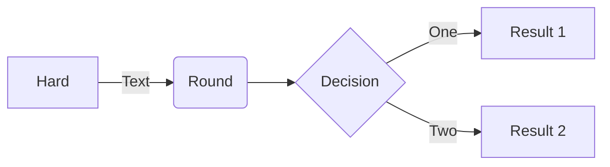

## Todo List

- ###  Main Program
  - [ ] security
    - [x] logout
    - [ ] Make new User
    - [x] authentication
    - [ ] authorisation
        - [ ] migrate enpoint to \user\* , \mod\*
  - [x] Messages for login
  - [x] Fix Listener Structure
  - [x] Fix Component Scan (scan one configuration file in EExampleApplication)
  - [x] Fix commandLineRunner
- ### Tests
  - [ ] Fix Listener (module) tests Structure
  - [ ] Fix integration tests
  - [ ] Fix ModTests
- ### Docs
  - [ ] Project Description (Mermaid)
  - [ ] Explain Weak List
  - [ ] Explain Security
- ### Future ideas
  - [ ] add Warning - as pre-ban
  - [ ] add public messages
  - [ ] add Friends
  - [ ] add tags
  - [ ] add sql
  - [ ] validation somewhere

