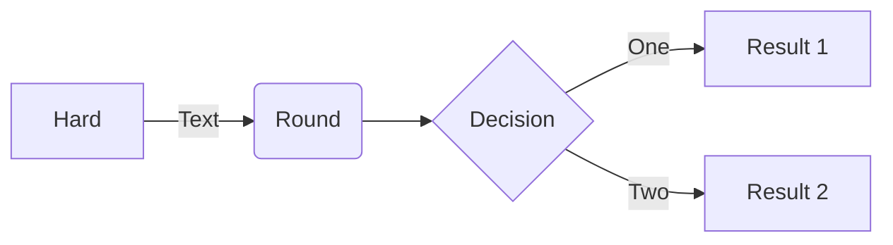

## Todo List
 
- ###  Main Program
  - [x] security
    - [x] logout
    - [x] Make new User
    - [x] authentication
    - [x] authorisation
        - [x] migrate enpoint to \user\* , \mod\*
  - [x] Messages for login
  - [x] Fix Listener Structure
  - [x] Fix Component Scan (scan one configuration file in EExampleApplication)
  - [x] Fix commandLineRunner
  - [x] add Warning - as pre-ban
    - [x] Secured User
    - [x] other security stuff
    - [x] listener
    - [x] service sends warning
    - [x] mod see who is warned
    - [x] user see he is warned
    - [x] mod can warn
  - [ ] add public messages
    - [x] modify Message
    - [x] queue for few public messages
    - [x] add to Data Runner
    - [x] make place for display
    - [ ] make posting them
    - [x] modify personal stream to show "public" tick
  - [x] make "ad info" default in listener
    - [x] remove infos from unnecesary places
  - [ ] mod post "ad" to all users    
    - [x] "ad" object
    - [x] implement listener in User
    - [ ] add ads in user template
    - [ ] add form in mod template
    - [ ] add logic in Controller
  - [x] ShutDown as Event
    - [x] event
    - [x] listenr
    - [x] button in mod
  - [ ] top level /mod or /user in controler
  - [x] redirect to user panel or mod panel depending on role  
    
- ### Tests
  - [ ] Fix Listener (module) tests Structure
  - [ ] Fix integration tests
  - [ ] Fix ModTests
- ### Docs
  - [ ] Project Description (Mermaid)
  - [ ] Explain Weak List
  - [ ] Explain Security
- ### Future ideas
  - [ ] "publicity" turn on/off for given message on user panel
  - [ ] add Friends
  - [ ] add tags
  - [ ] perhaps sql
  - [ ] validation somewhere

